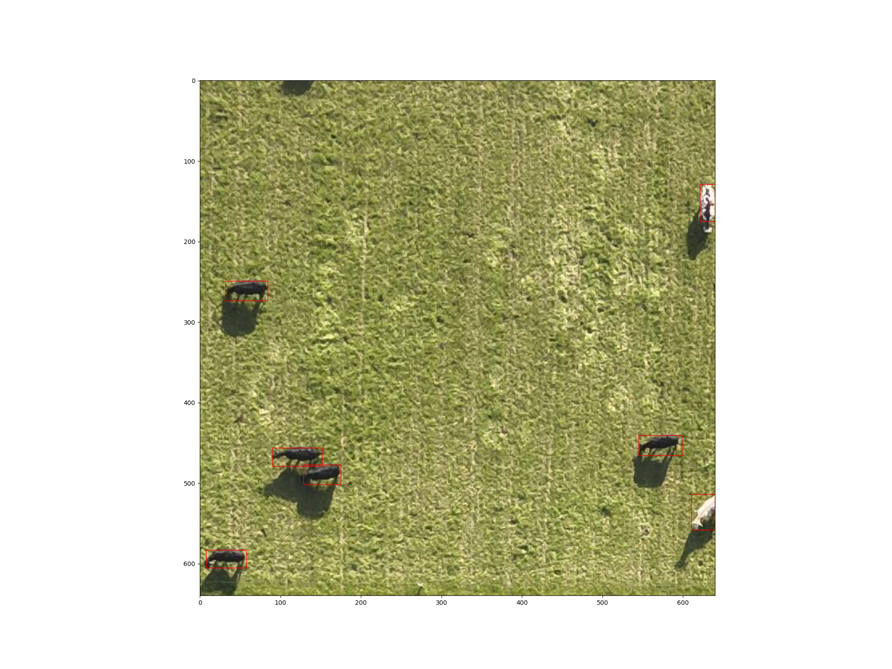

# Cow Detection Model v2

This repository contains code for a cow detection model using PyTorch and YOLO.  
The key difference between the first version of the cow detection model and the current one is the preprocessing of images before training. Specifically, we resize large images to smaller ones with dimensions of 640 x 640 pixels.

## Requirements

- **GPU**: The model requires a GPU to train efficiently. Please ensure that you have access to a GPU before proceeding.  
- **PyTorch Library**: Refer to the PyTorch website to install the appropriate version based on your operating system. You can find the installation instructions here: <https://pytorch.org/>  
- **YOLO Library**: You can install the YOLO library by running `pip install ultralytics`.
- **yaml file**: Give the access directory to the dataset.

## Dataset

The dataset used for training this model consists of images collected from three outdoor cattle farms in France using a UAV (Mavic 3 Enterprise or Mavic 3 Thermal). The flights were conducted at an altitude of 30, 60 or 100 meters in nadir position. Images and their corresponding labeling files are available on the Zenodo repository [ICAERUS HE Project](https://zenodo.org/records/10245396).

The following breeds with distinct body colors are present in the dataset:
- **White**: Charolaises in Jalogny farm
- **Spotted**: Prim'Holstein, Normandes in Mauron and Derval farms
- **Black/red**: Salers, along with some black Prim'Holstein in Mauron and Derval farms

Image size can be 4000x3000 or 5280x3956 depending on the drone used.

## Data Preparation

All images from Jalogny and Mauron farms taken at 60 or 100 meters were used (955 over 1148). Dataset was split into training, validation and test with a ratio of 70/20/10.

| Color body | White | Spotted | Red/Black |
| --- | :---: | :---: | :---: | 
| Number of images | 127  | 25 | 38 |
| Number of animals | 1 408 | 690 | 357 | 

Afterward, all images underwent cropping to fit the required 640 × 640 pixel dimensions suitable for YOLO models. The Python script responsible for implementing this process will soon be accessible via this GitHub repository.

From this single source image, 6 x 4 smaller subimages measuring are extracted.

Here is the number of obtained images at the end of the process:
|  | Train | Validation | Test |
| --- | :---: | :---: | :---: | 
| Number of images | 24 024 | 6 864 | 3 455 |
| % of images   with animals | 1.78 | 1.89 | 1.94 |

## Model parameters

- pre-trained model: yolov8m.pt
- batch: 8
- optimizer: auto
- lr: 0.01
- momentum: 0.937

## Results

Metrics: 
- Precision: 0.93
- Recall: 0.85
 

An example of cow detection in a image from test population:

<!--[PRcurve?]
[ROCcurve]
[IOU] -->